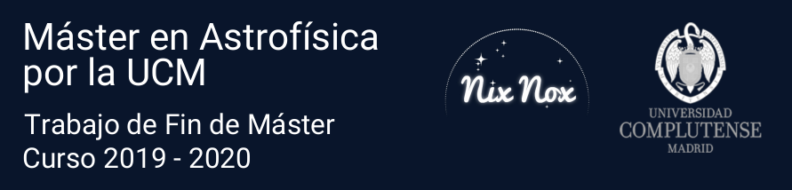
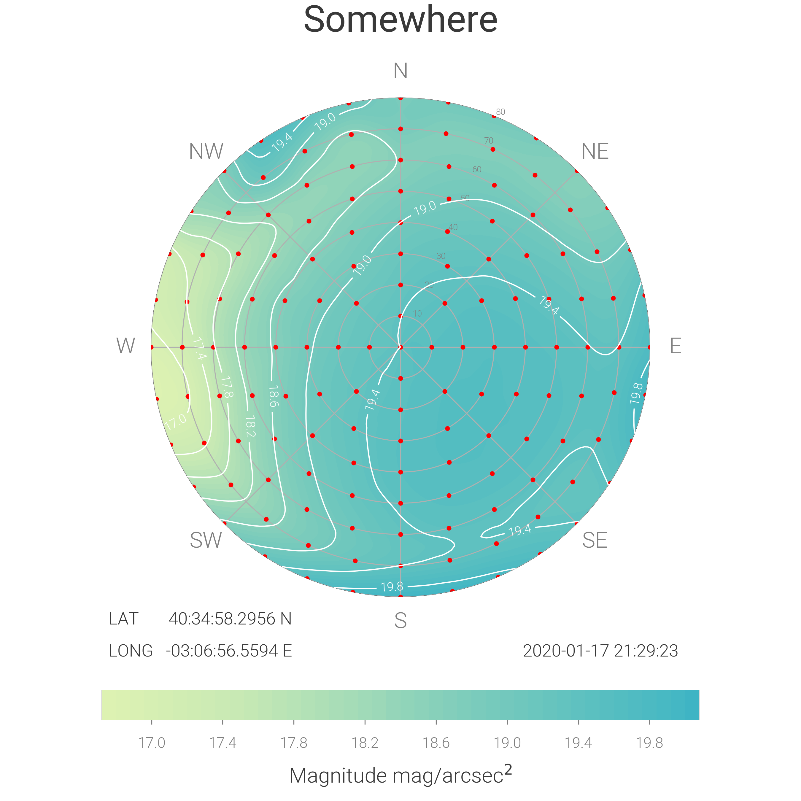

# An open science approach against light pollution: NixNox web and database

This is the public repository for the [NixNox](https://nixnox.stars4all.eu/) data web and database code. Here you can see the publicly available code used in the development of the NixNox data reception and query page and the tools created for managing the data. 

This work has been done as the **Master's thesis** named *Ciencia abierta contra la contaminación lumínica. Nixnox: automatización y Base de Datos*, by the author **Borja Sánchez Leirado**. This thesis is presented to complete the [MS in Astrophysics by the UCM](https://www.ucm.es/masterastrofisica), in September 2020. 

### NixNox

NixNox is an open science project, originally conceived as an answer to the question *Where may I go to enjoy the sky with my family?* This project is a collaboration between professionals and amateurs, where observers collect data of the night sky, to create allsky maps. The idea was originally developed by professor [Jaime Zamorano](https://webs.ucm.es/info/Astrof/users/jaz/jaz.html), at the Astrophysics department in the UCM.

Through the years, NixNox has become  a quite productive data repository, and with this thesis we have converted all this descriptive information into public science-valuable data.

As far as we know, this is the first public repository for ground-based allsky photometer data.

Here is an example of the allsky maps generated. 

### Thesis

A copy of the thesis can be found [here](doc/thesis/TFM_BorjaSanchezLeirado.pdf).

### Web page

A first display of the web application for submitting data, described in the thesis, can be visited following [this link](http://halmax.fis.ucm.es). Please, 

Please note that some features may not perform at their best, especially those related to CSS. I recommend for this link to use the "computer view" mode for mobile devices.

### Example files to send data

In order to test the app by yourself, we provide you with some TAS photometer example files. These files are located [here](doc/examples/files).

To send the data, you must sign in in the web page, and complete the form by selecting the following values at the corresponding fields:

+   Photometer: `TFM-test`
+   Institution: `UCM-test`
+   Author: your username, as the email provided in the sign in form.

Then, select the provided `.txt` file 

### Query data

You can query some data by using the `quey data` page, where a list of all measurements is provided, or by using the `query map` page (recommended). The later returns a `csv` file with the data of all the entries queried.

### 3rd party python software

A complete list of the pip packages employed in this project can be found on the Pipfile ([here](./Pipfile))

